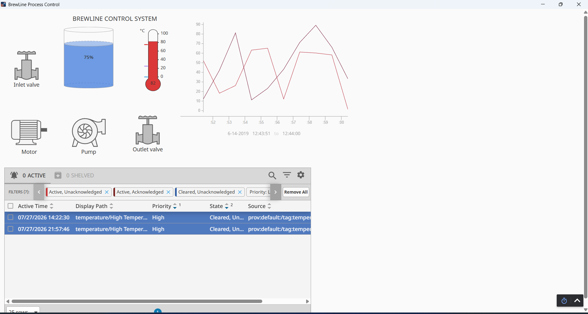
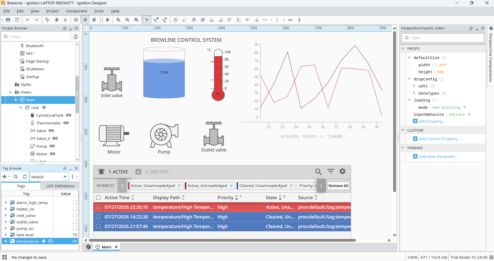
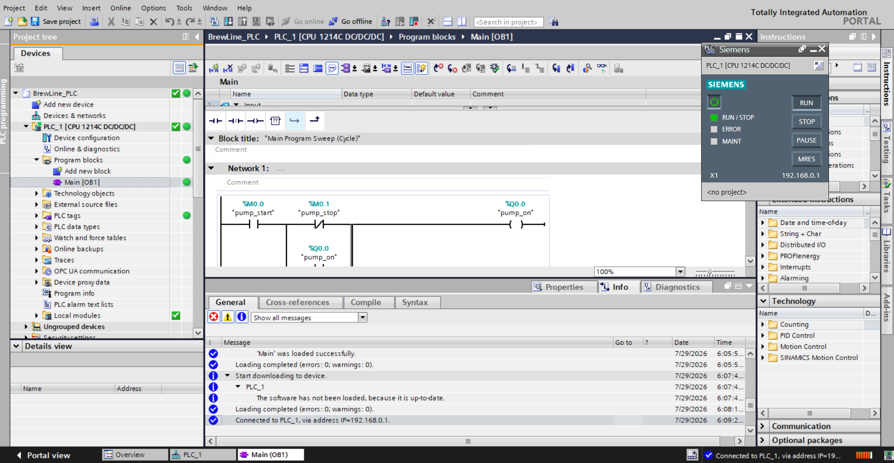
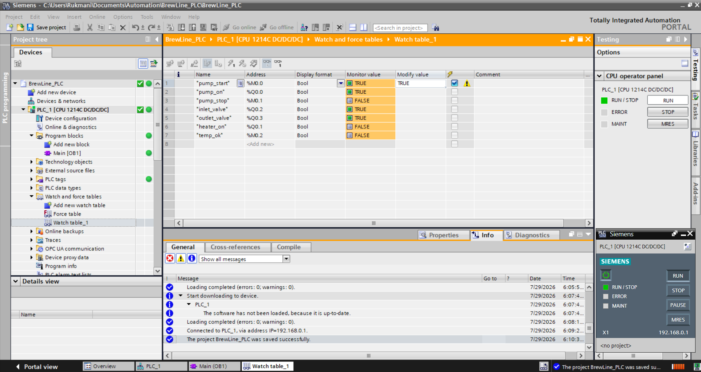
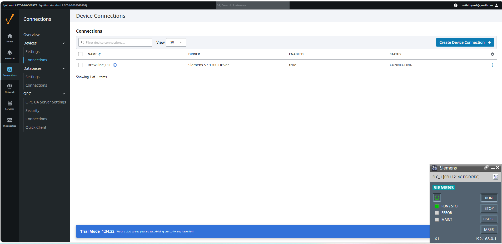
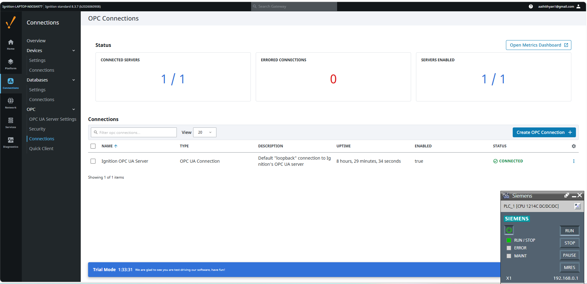
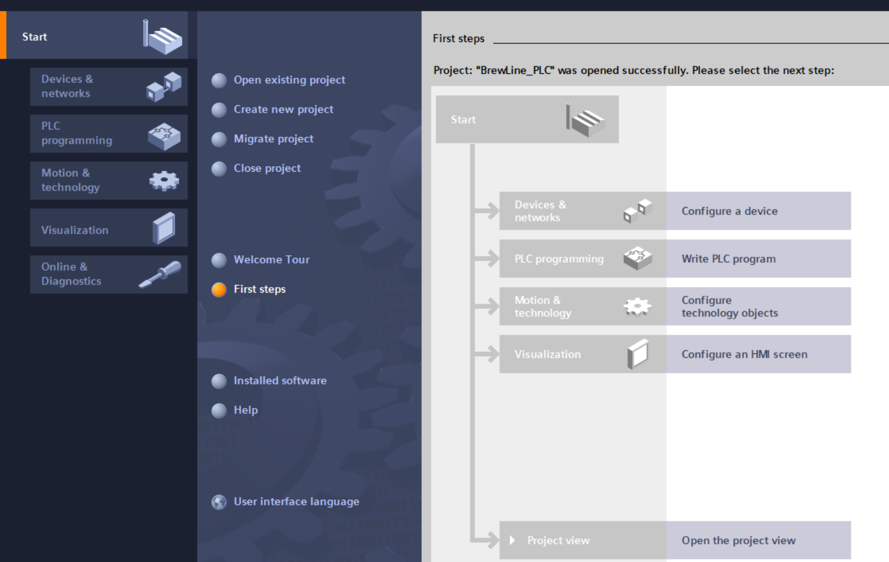

# BrewLine
Brewery automation system — Siemens S7-1200 PLC + Ignition SCADA

---

```markdown
# BrewLine — Brewery Automation System

A full-stack industrial automation project built from scratch using Siemens TIA Portal, S7-PLCSIM, and Ignition SCADA/HMI.

---

## Project Overview

BrewLine simulates a brewery process control system covering:
- PLC ladder logic for pump, valve and heater control
- SCADA/HMI with live tag bindings, alarms and trending
- Industrial communication configuration (S7 driver, OPC-UA)

Built as a self-directed learning project to achieve interview-ready knowledge for junior automation engineer roles in the UK.

---

## System Architecture

```
┌─────────────────────────────────────────────────────┐
│                    BrewLine System                   │
├───────────────────────┬─────────────────────────────┤
│     PLC Layer         │        SCADA/HMI Layer       │
│                       │                             │
│  Siemens S7-1200      │     Ignition 8.3.7          │
│  CPU 1214C DC/DC/DC   │     Perspective HMI         │
│  TIA Portal V17       │     localhost:8088           │
│  S7-PLCSIM V17        │                             │
│                       │                             │
│  Ladder Logic (LAD)   │  Live tag bindings          │
│  4 Networks in OB1    │  Alarm management           │
│                       │  Time series trending        │
└───────────────────────┴─────────────────────────────┘
         │                          │
         └──── S7 Driver ───────────┘
              Port 102 / PUT-GET enabled
```

---

## PLC Configuration

**Hardware:** Siemens S7-1200 CPU 1214C DC/DC/DC (simulated in S7-PLCSIM V17)

**PLC Tags:**

| Tag | Type | Address | Description |
|---|---|---|---|
| pump_start | Bool | M0.0 | Momentary start signal |
| pump_stop | Bool | M0.1 | Stop signal (NC contact) |
| temp_ok | Bool | M0.2 | Temperature safe flag |
| pump_on | Bool | Q0.0 | Pump output |
| heater_on | Bool | Q0.1 | Heater output |
| inlet_valve | Bool | Q0.2 | Inlet valve output |
| outlet_valve | Bool | Q0.3 | Outlet valve output |
| temperature | Real | MD10 | Process temperature °C |

---

## Ladder Logic — OB1 Networks

**Network 1 — Pump Start/Stop with Seal-in Circuit:**
```
|--[pump_start]--+--[/pump_stop]--( pump_on )--|
                 |                             |
                 +------[pump_on]-------------+
```
Standard industrial seal-in (latching) circuit. Pump stays ON after momentary start until stop is pressed.

**Network 2 — High Temperature Interlock:**
```
|--[temp_ok]--( heater_on )--|
```
Heater cuts out automatically when temperature exceeds safe limit. temp_ok goes FALSE above 90°C.

**Network 3 — Inlet Valve:**
```
|--[pump_on]--( inlet_valve )--|
```
Inlet valve opens automatically when pump is running.

**Network 4 — Outlet Valve:**
```
|--[pump_on]--( outlet_valve )--|
```
Outlet valve opens automatically when pump is running.

---

## HMI Features — Ignition Perspective

- **Cylindrical Tank** — live level display bound to tank_level tag (Float)
- **Thermometer** — live temperature display bound to temperature tag (Float)
- **Inlet Valve** — state expression: `if({[default]inlet_valve}, "open", "closed")`
- **Outlet Valve** — state expression: `if({[default]outlet_valve}, "open", "closed")`
- **Pump** — state expression: `if({[default]pump_on}, "on", "off")`
- **Motor/Heater** — state expression: `if({[default]heater_on}, "on", "off")`
- **Alarm Status Table** — live alarm display with filter tabs
- **Time Series Chart** — temperature trend history with tag history binding
- **Title Label** — BREWLINE CONTROL SYSTEM

---

## Alarm Configuration

| Alarm | Tag | Setpoint | Priority | Behaviour |
|---|---|---|---|---|
| High Temperature | temperature | > 90°C | High | Active until acknowledged and cleared |

Configured following EEMUA 191 alarm management principles:
- Alarm states: Active Unacknowledged → Active Acknowledged → Cleared
- Priority: High (operator response target < 5 minutes)
- Alarm history logged in Ignition

---

## Communication Setup

| Setting | Value |
|---|---|
| Driver | Siemens S7-1200 Driver (Ignition built-in) |
| Hostname | 192.168.0.1 (PLCSIM local address) |
| Port | 102 (S7 protocol) |
| PUT/GET Communication | Enabled in TIA Portal CPU properties |
| Ignition OPC UA Server | Connected (port 62541) |

Note: The S7-1200 trial license does not include OPC-UA server functionality. In a production environment with a licensed PLC, full OPC-UA communication on port 4840 would be used.

---

## Screenshots

### HMI Live — Perspective Workstation


### Ignition Designer — Full Project View


### TIA Portal — Ladder Logic Online with PLCSIM


### Watch Table — Live Tag Values


### Ignition — S7-1200 Device Connection


### Ignition — OPC UA Connections


### TIA Portal — Project Overview


---

## Tech Stack

| Tool | Version | Purpose |
|---|---|---|
| Siemens TIA Portal | V17 | PLC engineering software |
| S7-PLCSIM | V17 | Virtual PLC simulation |
| Ignition by Inductive Automation | 8.3.7 | SCADA/HMI platform |
| Ignition Perspective | 8.3.7 | HMI development module |
| Perspective Workstation | 1.3.7 | HMI runtime client |

---

## Key Concepts Demonstrated

**PLC Programming:**
- IEC 61131-3 Ladder Diagram (LAD) programming
- PLC scan cycle understanding
- Tag addressing — I (inputs), Q (outputs), M (memory), MD (real values)
- Seal-in (latching) circuits for motor control
- Safety interlocks — high temperature cutout
- Normally Open and Normally Closed contact logic

**SCADA/HMI:**
- Ignition Perspective component bindings
- Expression-based symbol state control
- Tag history and time series trending
- Alarm configuration and management
- EEMUA 191 alarm principles

**Industrial Communication:**
- S7 protocol (port 102) with PUT/GET enabled
- OPC-UA architecture (client/server model)
- Purdue Model — Level 1 PLC to Level 2 SCADA
- Siemens S7-1200 driver configuration in Ignition

---

## Project Structure

```
BrewLine/
│
├── screenshots/
│   ├── hmi_live.png
│   ├── ignition_designer.png
│   ├── ladder_logic.png
│   ├── watch_table.png
│   ├── device_connection.png
│   ├── opc_connection.png
│   └── tia_portal.png
│
├── README.md
│
└── notes/
    └── session_notes.md
```

---

## Learning Journey

This project was built across 7 structured self-learning sessions:

| Session | Topic |
|---|---|
| 1-2 | Ignition installation, tag creation, basic HMI |
| 3 | Full Perspective HMI — alarms, trending, symbol bindings |
| 4 | TIA Portal — CPU setup, PLC tags, ladder logic, PLCSIM |
| 5 | Theory — scan cycle, IEC 61131-3, OPC-UA, P&ID, SCADA vs DCS, EEMUA 191, fieldbuses |
| 6 | Communication — S7 driver, OPC-UA configuration |
| 7 | Mock interview preparation |

---

## Author

**Aathithyan Venkatesh**
Mechanical Engineering Graduate | Self-taught Python Developer
Bournemouth, UK | Unrestricted right to work in the UK

[Portfolio](https://aathithyan-venkatesh.onrender.com) | [LinkedIn](https://linkedin.com/in/aathi101)
```


